# Operations Performance MIS

**An end-to-end Operations Performance Management Information System built with Python, Excel, and Power BI.**

Simulates a back-office document processing operation and delivers a complete analytics stack — from raw data generation through a KPI engine, an automated daily Excel MIS report, and a 6-page interactive Power BI dashboard.


---

## Table of Contents

- [Overview](#overview)
- [Business Scenario](#business-scenario)
- [Results Snapshot](#results-snapshot)
- [Power BI Dashboard](#power-bi-dashboard)
- [Excel Daily MIS](#excel-daily-mis)
- [Data Model](#data-model)
- [Tech Stack](#tech-stack)
- [Project Structure](#project-structure)
- [Data Pipeline](#data-pipeline)
- [Key Insights](#key-insights)
- [How to Run](#how-to-run)
- [Documentation](#documentation)
- [Future Improvements](#future-improvements)
- [Author](#author)

---

## Overview

Operations managers need a fast, reliable way to see how their teams, shifts, and employees are performing on any given day — and where to intervene. This project builds that system end to end:

1. **Generate** realistic synthetic operations data
2. **Clean & validate** it against a master employee dataset
3. **Engineer KPIs** — productivity, quality, SLA, attendance, backlog
4. **Aggregate** by team, process, shift, employee, and day
5. **Report** it two ways — an automated, print-ready Excel MIS and an interactive Power BI dashboard

Everything in the [Planned deliverables](#overview) below is fully built and included in this repo.

## Business Scenario

The project simulates a back-office document processing operation where employees across multiple **teams**, **processes**, and **shifts** receive and process records daily, while being monitored on:

- Productivity
- Quality & Accuracy
- SLA achievement
- Attendance & Absenteeism
- Workload & Backlog
- Errors & Rework

**Dataset scale:** ~1,640 employee-day operational records · 40 employees · 4 teams · 4 processes · 4 shifts · Jul 1 – Aug 10, 2026

## Results Snapshot

Headline numbers as of the latest MIS date (10-Aug-2026), aggregated across the full reporting period:

| KPI | Actual | Target | Status |
|---|---:|---:|:---:|
| Productivity % | 74.63% | 75% | 🟡 Near Target |
| Accuracy % | 95.73% | 95% | 🟢 On Target |
| SLA % | 91.29% | 95% | 🔴 Below Target |
| Attendance % | 94.57% | 95% | 🟡 Near Target |
| Error Rate % | 4.27% | — | — |
| Rework Rate % | 2.05% | — | — |
| Closing Backlog | 35,931 records | — | 🔴 Rising |

**Volume:** 174,513 records received · 138,582 processed · 39,116 pending

## Power BI Dashboard

A 6-page interactive dashboard with Date / Team / Process / Shift slicers on every page.

| Executive Overview | Employee Performance |
|---|---|
| 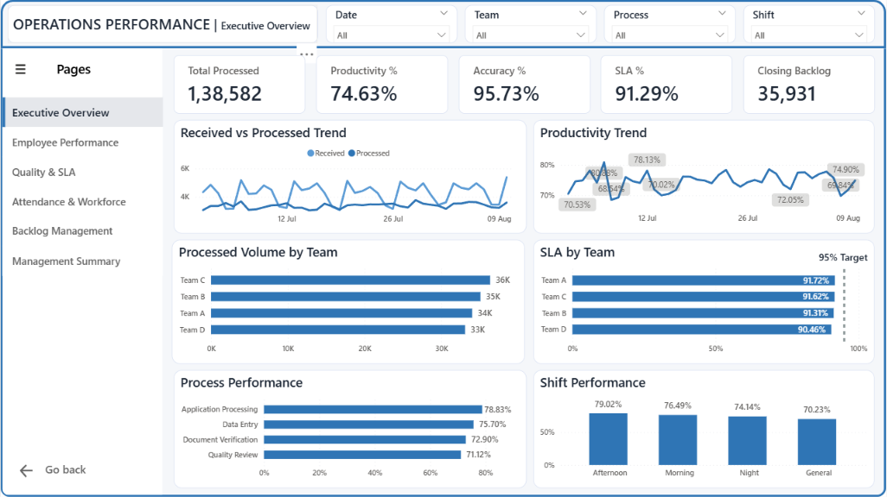 | 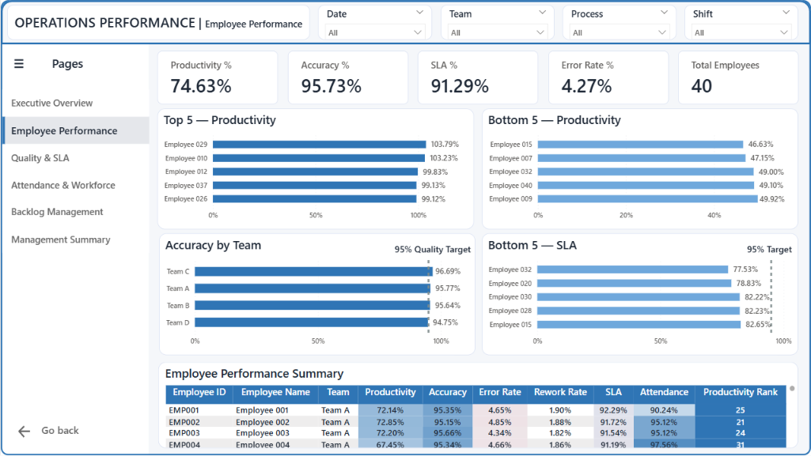 |

| Quality & SLA | Attendance & Workforce |
|---|---|
| 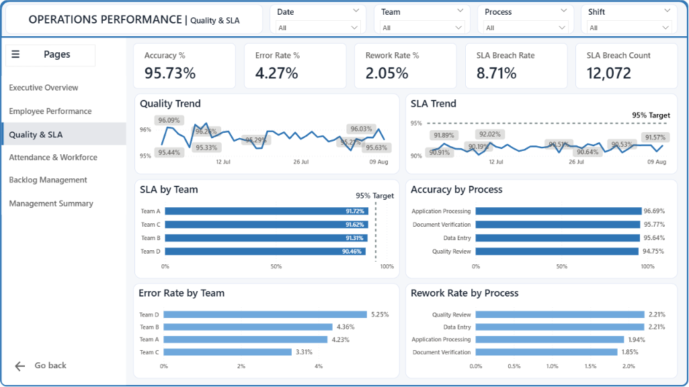 | 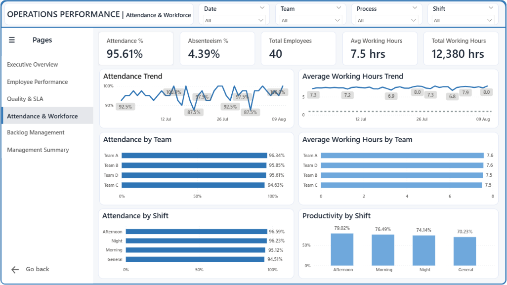 |

| Backlog Management | Management Summary |
|---|---|
| 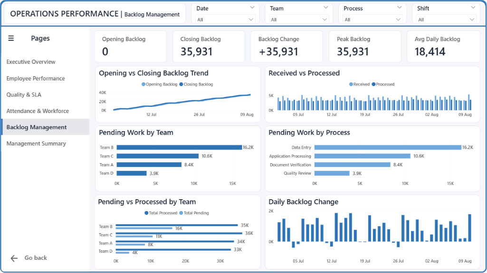 | 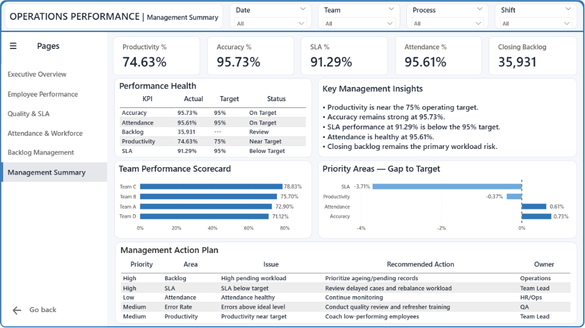 |

## Excel Daily MIS

An automated, print-ready daily report ([`reports/Daily_Operations_MIS.xlsx`](reports/Daily_Operations_MIS.xlsx)) with conditional-formatted KPI cards and auto-generated **Key Issues** and **Recommended Actions**, driven entirely by the day's data — not hardcoded text.

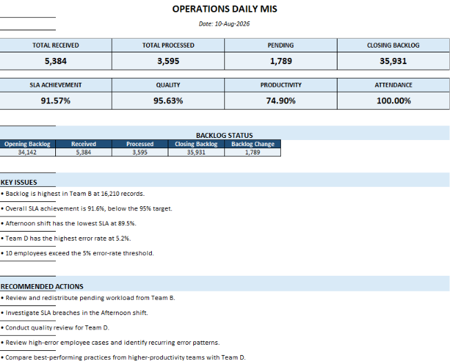

<details>
<summary>Supporting sheets (Team / Shift / Employee / Backlog)</summary>

| Team Performance | Shift Performance |
|---|---|
| 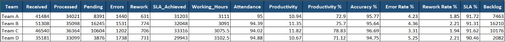 | 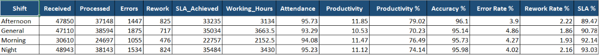 |

| Employee Performance | Daily Backlog |
|---|---|
| 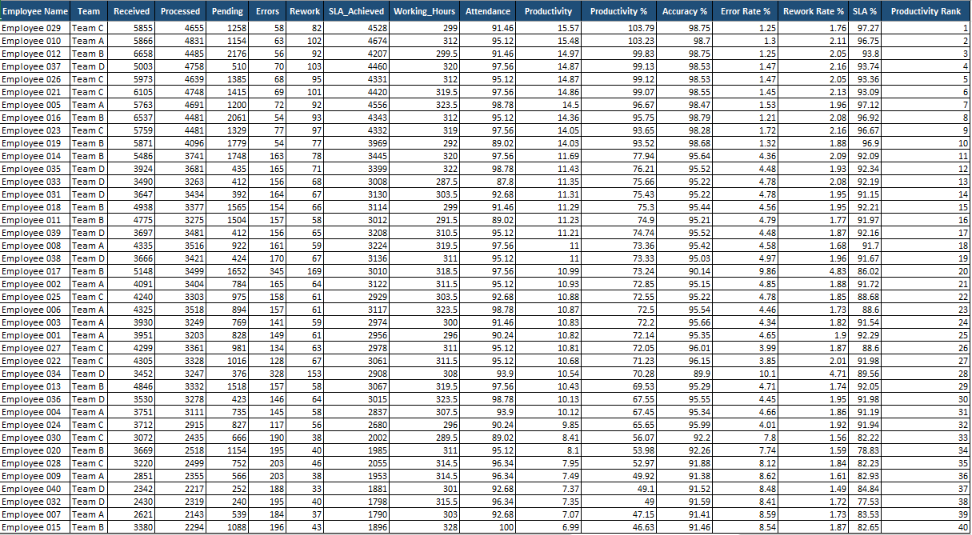 | 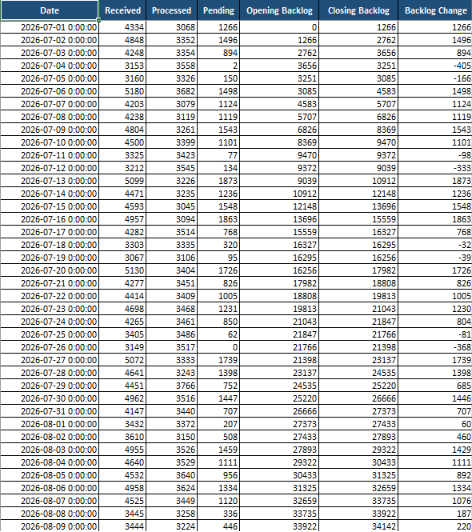 |

</details>

## Data Model

The Power BI model uses a fact/dimension layout — `fact_operations` (employee-day grain) and `fact_daily_performance` / `fact_daily_backlog` (day grain) joined to `dim_team`, `dim_process`, `dim_shift`, `dim_employee`, and a `DateTable`.

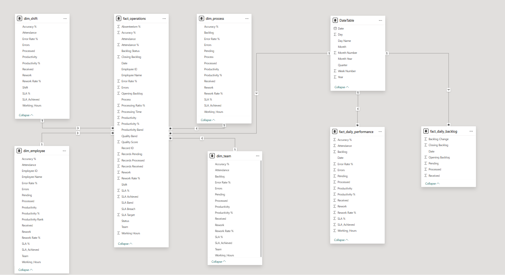

## Tech Stack

- **Python** — pandas, numpy, openpyxl (see [`requirements.txt`](requirements.txt))
- **Excel** — automated report generation with conditional formatting
- **Power BI** — data modeling, DAX measures, interactive dashboards
- **Git & GitHub** — version control

## Project Structure

```
operations-performance-mis/
│
├── data/
│   ├── raw/                       # Source data (employee_master.csv, operations_data.csv)
│   ├── cleaned/                   # Validated, deduplicated data
│   ├── processed/                 # KPI-engineered + aggregated datasets
│   └── powerbi/                   # Star-schema exports for Power BI
│
├── documentation/
│   ├── project_scope.md           # Business objective, scope, deliverables
│   ├── operations_schema.md       # Column definitions & KPI formulas
│   ├── data_dictionary.md         # Field-level data dictionary
│   └── planned_deliverables.md    # Completed scope + roadmap of planned work
│
├── python/
│   ├── generate_data.py           # Synthetic data generation
│   ├── clean_data.py              # Cleaning, validation, consistency checks
│   ├── calculate_kpis.py          # KPI engineering (productivity, SLA, backlog, bands)
│   ├── analyze_performance.py     # Team / process / shift / employee / daily aggregation
│   ├── prepare_powerbi.py         # Star-schema export for Power BI
│   └── create_daily_mis.py        # Automated Excel MIS report generator
│
├── powerbi/
│   └── Operations_Performance_MIS.pbix
│
├── reports/
│   └── Daily_Operations_MIS.xlsx
│
├── screenshots/
│   ├── excel/                     # Excel MIS screenshots
│   └── powerbi/                   # Power BI dashboard screenshots
│
├── requirements.txt
├── .gitignore
└── README.md
```

## Data Pipeline

```
generate_data.py  →  clean_data.py  →  calculate_kpis.py  →  analyze_performance.py
                                                                        │
                              ┌─────────────────────────────────────────┤
                              ▼                                         ▼
                     prepare_powerbi.py                        create_daily_mis.py
                     → Power BI star schema                    → Daily_Operations_MIS.xlsx
```

1. **`generate_data.py`** — creates the synthetic Employee Master and Operations datasets
2. **`clean_data.py`** — standardizes types, removes duplicates, validates numeric ranges and attendance/status codes, cross-checks Employee ↔ Team ↔ Process consistency against the master
3. **`calculate_kpis.py`** — computes Productivity, Productivity %, Error/Accuracy/Rework %, SLA %, SLA Breach flag, Attendance %/Absenteeism %, running Opening/Closing Backlog, and Productivity/Quality/SLA bands
4. **`analyze_performance.py`** — rolls the record-level data up into Team, Process, Shift, Employee, and Daily performance summaries
5. **`prepare_powerbi.py`** — exports fact and dimension tables into `data/powerbi/` for the Power BI model
6. **`create_daily_mis.py`** — builds the styled, conditional-formatted Excel MIS with data-driven Key Issues and Recommended Actions

## Key Insights

- **SLA is the primary risk area** — 91.29% overall vs a 95% target, with the **Afternoon shift** lagging most (89.47%)
- **Team B carries the heaviest backlog** (16,210 pending records) and is the single largest driver of the rising closing backlog (35,931)
- **Team D has the highest error rate** (5.25%), flagged for a quality review
- **10 employees exceed the 5% error-rate threshold**, identified for targeted coaching
- Accuracy (95.73%) and Attendance (94.57%) are both healthy and near/at target

## How to Run

```bash
# Clone the repository
git clone https://github.com/Abhishek-Savita-3012/operations-performance-mis.git
cd operations-performance-mis

# Install dependencies
pip install -r requirements.txt

# Run the pipeline in order
python python/generate_data.py
python python/clean_data.py
python python/calculate_kpis.py
python python/analyze_performance.py
python python/prepare_powerbi.py
python python/create_daily_mis.py
```

Open `powerbi/Operations_Performance_MIS.pbix` in Power BI Desktop and refresh the data source to point at `data/powerbi/` if the file paths differ on your machine.

## Documentation

- [`project_scope.md`](documentation/project_scope.md) — business objective, scope, and deliverables
- [`operations_schema.md`](documentation/operations_schema.md) — column definitions and derived-metric formulas
- [`data_dictionary.md`](documentation/data_dictionary.md) — field-level dictionary for both source tables

## Future Improvements

- Add a `LICENSE` file
- Parameterize SLA/productivity/error-rate thresholds into a shared config used by both the Excel and Power BI layers
- Add automated tests for the KPI engineering logic
- Convert the Power BI `dim_*` tables into true attribute-only dimensions, with metrics computed as DAX measures against the fact tables

## Author

**Abhishek Savita**
Final-year B.Tech CSE (AI/ML)
GitHub: [@Abhishek-Savita-3012](https://github.com/Abhishek-Savita-3012)